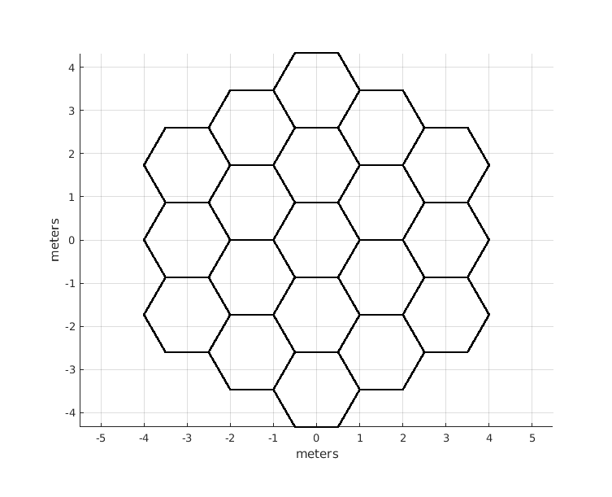
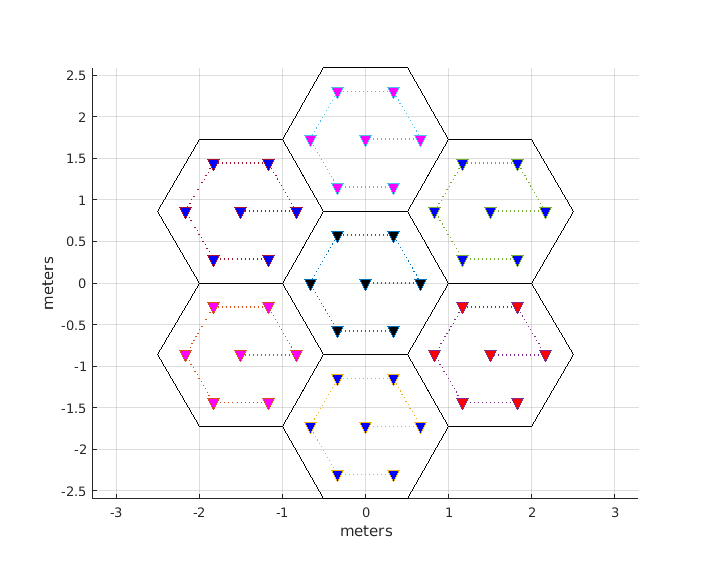

## Matlab scripts for LTE

This repo is created for sharing Matlab (and if needed C++ and Python) scripts that are commonly used in simulation of mobile networks such as LTE. You are welcome to ask for new functions and features. Upon request, scripts for analyzing OFDM signals, GSM, LTE and Software Defined Radio tools can be shared.

### generateHexGrid.m
This function generates multi-cell hexagonal grid which is typically used in cellular network simulation.

  

### generateDAS.m
This function deploys Remote Radio Units (RRUs) of a Distributed Antenna System (DAS) in a hexagonal grid.

  

